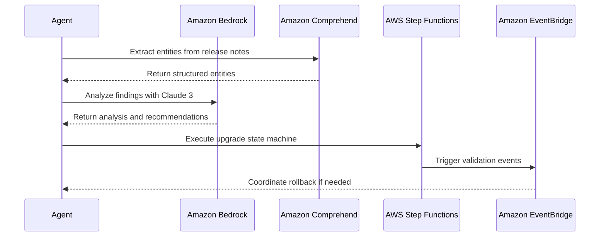
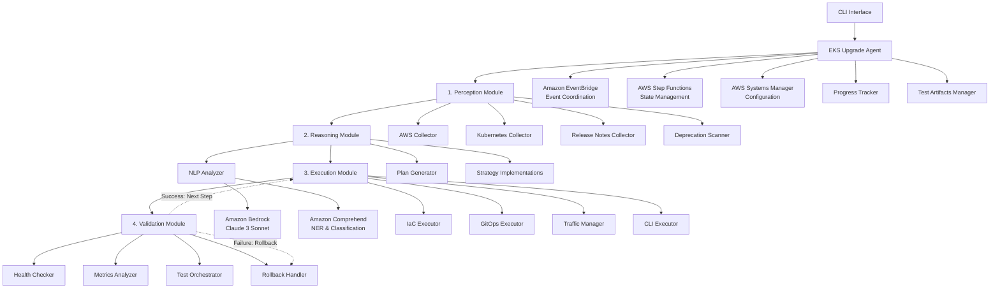
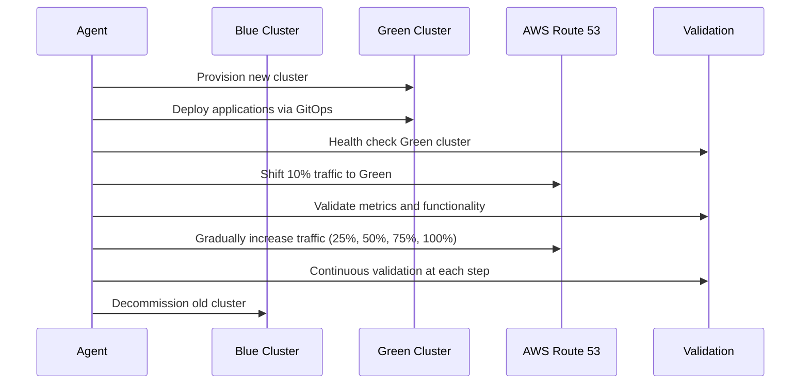
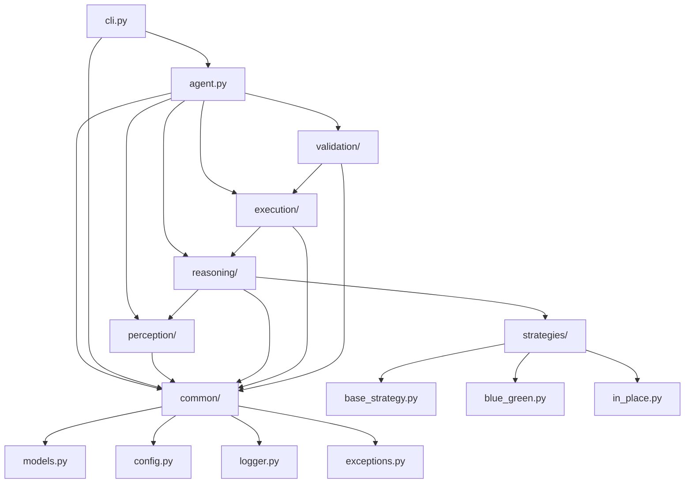

# EKS Upgrade Agent Design Document

## Overview

The EKS Upgrade Agent is a sophisticated autonomous AI system designed to manage Amazon EKS cluster upgrades with zero downtime using Blue/Green deployment strategies. The system follows an agentic AI architecture with four core modules: Perception (data gathering), Reasoning (analysis and planning), Execution (action implementation), and Validation (verification and rollback).

The agent is built as a modular Python library that can be distributed via PyPI and integrated into existing DevOps workflows. It leverages Infrastructure as Code (Terraform), GitOps tools (ArgoCD/Flux), and AWS services to orchestrate complex upgrade scenarios autonomously.

## Architecture

### AWS AI Services Integration

The EKS Upgrade Agent leverages AWS AI services for intelligent decision-making and analysis:

#### Core AI Services

- **Amazon Bedrock**: Primary reasoning engine using Claude 3 Sonnet for complex analysis and decision-making
- **Amazon Comprehend**: Named Entity Recognition and custom classification for release notes analysis

#### Orchestration Services

- **AWS Lambda + Step Functions**: Serverless orchestration of agent phases with state management
- **Amazon EventBridge**: Event-driven coordination for validation phases and rollback procedures
- **AWS Systems Manager Parameter Store**: Secure configuration and credential management

#### Integration Patterns



### High-Level Architecture



### Agentic AI Control Loop

The agent operates on a sequential four-phase cycle for each upgrade step:

1. **Perception Phase**: Gather comprehensive environmental data about current cluster state, dependencies, and target version requirements
2. **Reasoning Phase**: Analyze collected data using NLP and generate a dynamic, step-by-step upgrade plan
3. **Execution Phase**: Execute individual steps from the plan (provision infrastructure, deploy applications, shift traffic)
4. **Validation Phase**: Verify success of each executed step and either proceed to next step or trigger rollback

The control flow is strictly sequential: Perception → Reasoning → Execution → Validation, with the validation phase determining whether to continue with the next execution step or initiate rollback procedures.

### Blue/Green Deployment Strategy

The core upgrade strategy provisions a new "Green" cluster alongside the existing "Blue" cluster, gradually shifting traffic while maintaining zero downtime:



## Project Structure

### Complete File Structure

```
eks_upgrade_agent/
├──.github/
│   └── workflows/
│       ├── test.yml
│       └── publish.yml
├── docs/
│   ├── conf.py
│   └── index.rst
├── examples/
│   ├── config/
│   │   └── sample_config.yaml
│   └── run_blue_green_upgrade.py
├── src/
│   └── eks_upgrade_agent/
│       ├── __init__.py
│       ├── agent.py
│       ├── cli.py
│       ├── common/
│       │   ├── __init__.py
│       │   ├── config.py
│       │   ├── exceptions.py
│       │   ├── logger.py
│       │   └── models.py
│       ├── perception/
│       │   ├── __init__.py
│       │   ├── aws_collector.py
│       │   ├── k8s_collector.py
│       │   ├── release_notes_collector.py
│       │   └── deprecation_scanner.py
│       ├── reasoning/
│       │   ├── __init__.py
│       │   ├── nlp_analyzer.py
│       │   ├── plan_generator.py
│       │   └── strategies/
│       │       ├── __init__.py
│       │       ├── base_strategy.py
│       │       ├── blue_green.py
│       │       └── in_place.py
│       ├── execution/
│       │   ├── __init__.py
│       │   ├── cli_executor.py
│       │   ├── gitops_executor.py
│       │   ├── iac_executor.py
│       │   └── traffic_manager.py
│       └── validation/
│           ├── __init__.py
│           ├── health_checker.py
│           ├── metrics_analyzer.py
│           ├── rollback_handler.py
│           └── test_orchestrator.py
├── tests/
│   ├── conftest.py
│   ├── integration/
│   └── unit/
├──.gitignore
├── LICENSE
├── pyproject.toml
└── README.md
```

### Directory Structure Explanation

- **`.github/workflows/`**: CI/CD pipeline definitions for automated testing and PyPI publishing
- **`docs/`**: Sphinx documentation configuration and source files
- **`examples/`**: Sample configurations and usage examples for users
- **`src/eks_upgrade_agent/`**: Main source code organized by functional modules
- **`tests/`**: Comprehensive test suite with unit and integration tests
- **Root files**: Project metadata, dependencies, and documentation

### Module Dependencies



## Components and Interfaces

### Core Agent (`agent.py`)

**EKSUpgradeAgent Class**

- Main orchestrator implementing the agentic control loop
- Coordinates all modules and manages upgrade lifecycle
- Maintains state and progress tracking
- Handles error recovery and rollback scenarios

```python
class EKSUpgradeAgent:
    def __init__(self, config: AgentConfig)
    async def run_upgrade(self, cluster_name: str, target_version: str, strategy: str) -> UpgradeResult
    def get_upgrade_status(self) -> UpgradeStatus
    def trigger_rollback(self) -> RollbackResult
```

### Perception Module

**AWS Collector (`aws_collector.py`)**

- Interfaces with AWS APIs via boto3
- Collects EKS cluster metadata, node group information, and dependent services
- Monitors AWS resource states and configurations

**Kubernetes Collector (`k8s_collector.py`)**

- Uses Kubernetes Python client for cluster introspection
- Gathers pod health, node status, and installed applications
- Collects Helm chart versions and custom resource definitions

**Release Notes Collector (`release_notes_collector.py`)**

- Web scraping using requests and BeautifulSoup4
- Fetches official AWS EKS and Kubernetes release notes
- Provides structured access to version-specific information

**Deprecation Scanner (`deprecation_scanner.py`)**

- Wrapper around kubent and pluto CLI tools
- Scans live clusters and manifest files for deprecated APIs
- Returns structured deprecation information for analysis

### Reasoning Module

**NLP Analyzer (`nlp_analyzer.py`)**

- Integrates with Amazon Bedrock for advanced reasoning using Claude 3 Sonnet/Haiku
- Uses Amazon Comprehend for Named Entity Recognition on release notes
- Leverages AWS AI services to extract breaking changes, deprecations, and required actions
- Classifies severity and impact using Amazon Comprehend custom classification models

**Plan Generator (`plan_generator.py`)**

- Synthesizes perception data into executable upgrade plans
- Dynamically adjusts plans based on NLP analysis findings
- Integrates with strategy implementations for plan generation
- Handles dependency resolution and step ordering

**Strategy Implementations (`strategies/`)**

- Abstract base strategy pattern for extensibility
- Blue/Green strategy with configurable traffic shifting
- In-place upgrade strategy for simpler scenarios
- Custom strategy support for specialized requirements

### Execution Module

**IaC Executor (`iac_executor.py`)**

- Terraform CLI wrapper for infrastructure provisioning
- Integrates with EKS Blueprints for standardized cluster creation
- Manages Terraform state and handles plan/apply/destroy operations
- Supports custom Terraform modules and configurations

**GitOps Executor (`gitops_executor.py`)**

- ArgoCD and Flux API integration
- Triggers application synchronization on new clusters
- Manages GitOps repository updates and deployments
- Handles application-specific configuration updates

**Traffic Manager (`traffic_manager.py`)**

- AWS Route 53 weighted routing management
- Implements gradual traffic shifting algorithms
- Monitors traffic distribution and health during transitions
- Provides immediate rollback capabilities

**CLI Executor (`cli_executor.py`)**

- Generic shell command execution wrapper
- Handles kubectl, helm, and velero operations
- Provides structured output parsing and error handling
- Manages command timeouts and retry logic

### Validation Module

**Health Checker (`health_checker.py`)**

- Multi-layer health validation (control plane, nodes, pods)
- Kubernetes readiness and liveness probe verification
- AWS service health monitoring
- Custom health check plugin support

**Metrics Analyzer (`metrics_analyzer.py`)**

- CloudWatch and Prometheus metrics integration
- SLA/SLO compliance monitoring during upgrades
- Error rate and latency analysis
- Performance regression detection

**Test Orchestrator (`test_orchestrator.py`)**

- Automated test suite deployment and execution
- Integration with testing frameworks (Newman, JMeter)
- Synthetic transaction monitoring
- Application-specific validation workflows

**Rollback Handler (`rollback_handler.py`)**

- Immediate traffic redirection to Blue cluster
- State preservation and cleanup operations
- Failure analysis and reporting
- Recovery procedure automation

### Supporting Components

**Configuration Manager (`common/config.py`)**

- YAML configuration file parsing and validation
- Environment variable override support
- AWS AI services configuration management
- Secure credential handling integration

**Logger (`common/logger.py`)**

- Centralized logging configuration
- Structured logging with JSON output
- Log level management and filtering
- Integration with AWS CloudWatch Logs

**Exception Handling (`common/exceptions.py`)**

- Custom exception hierarchy for different failure modes
- Error context preservation and stack trace management
- Integration with rollback mechanisms
- Structured error reporting for debugging

**Data Models (`common/models.py`)**

- Pydantic-based data validation and serialization
- Type-safe interfaces between modules
- AWS AI service response models
- Configuration and state management models

**Progress Tracker (`common/progress_tracker.py`)**

- Real-time upgrade progress monitoring
- Task and subtask status management
- Progress persistence and recovery
- WebSocket-based status streaming
- Integration with AWS EventBridge for notifications

**Test Artifacts Manager (`common/test_artifacts.py`)**

- Organized storage of test results and logs
- Artifact retention and cleanup policies
- Test report generation and visualization
- Integration with CI/CD pipelines
- S3-based artifact storage for distributed teams

## Data Models

### Core Data Structures (using Pydantic)

```python
class ClusterState(BaseModel):
    cluster_name: str
    current_version: str
    node_groups: List[NodeGroupInfo]
    addons: List[AddonInfo]
    applications: List[ApplicationInfo]
    deprecated_apis: List[DeprecatedAPIInfo]

class UpgradePlan(BaseModel):
    plan_id: str
    source_version: str
    target_version: str
    strategy: StrategyType
    steps: List[UpgradeStep]
    estimated_duration: timedelta
    rollback_plan: RollbackPlan

class UpgradeStep(BaseModel):
    step_id: str
    name: str
    description: str
    executor: str
    parameters: Dict[str, Any]
    validation_criteria: List[ValidationCriterion]
    rollback_action: Optional[RollbackAction]

class ValidationResult(BaseModel):
    step_id: str
    status: ValidationStatus
    metrics: Dict[str, float]
    errors: List[ValidationError]
    timestamp: datetime

class BedrockAnalysisResult(BaseModel):
    analysis_id: str
    findings: List[str]
    severity_score: float
    confidence: float
    recommendations: List[str]

class ComprehendEntity(BaseModel):
    text: str
    type: str
    confidence: float
    begin_offset: int
    end_offset: int

class AWSAIConfig(BaseModel):
    bedrock_model_id: str = "anthropic.claude-3-sonnet-20240229-v1:0"
    comprehend_endpoint: Optional[str] = None
    step_functions_arn: Optional[str] = None
    eventbridge_bus_name: str = "default"
    ssm_parameter_prefix: str = "/eks-upgrade-agent/"
```

## Error Handling

### Exception Hierarchy

- **PerceptionError**: Data collection failures, API timeouts
- **PlanningError**: Invalid configurations, unsupported versions
- **ExecutionError**: Infrastructure provisioning failures, deployment errors
- **ValidationError**: Health check failures, performance regressions

### Error Recovery Strategies

1. **Retry Logic**: Configurable retry policies for transient failures
2. **Circuit Breakers**: Prevent cascading failures in dependent services
3. **Graceful Degradation**: Continue with reduced functionality when possible
4. **Automatic Rollback**: Immediate traffic redirection on critical failures

## Testing Strategy

### Unit Testing

- Comprehensive test coverage for all modules (>90%)
- Mock external dependencies (AWS APIs, Kubernetes API)
- Property-based testing for data models and algorithms
- Isolated testing of individual components

### Integration Testing

- End-to-end upgrade scenarios in test environments
- Multi-cluster testing with real AWS infrastructure
- GitOps workflow validation with actual repositories
- Performance testing under various load conditions

### Test Organization Structure

```
tests/
├── artifacts/           # Test outputs and reports
│   ├── unit/           # Unit test results
│   ├── integration/    # Integration test results
│   └── performance/    # Performance test results
├── fixtures/           # Test data and configurations
├── mocks/             # Mock implementations
└── utils/             # Testing utilities and helpers
```

### Continuous Testing

- Automated test execution on every commit
- Nightly integration tests against live AWS accounts
- Performance regression testing
- Security vulnerability scanning

## Security Considerations

### Authentication and Authorization

- AWS IAM role-based access control
- Kubernetes RBAC integration
- Secure credential management using AWS Secrets Manager
- Multi-factor authentication support for critical operations

### Data Protection

- Encryption in transit and at rest
- Secure handling of sensitive configuration data
- Audit logging of all operations
- Compliance with security frameworks (SOC 2, ISO 27001)

### Network Security

- VPC isolation for cluster communications
- Security group restrictions for inter-cluster traffic
- TLS encryption for all API communications
- Network policy enforcement during upgrades

## Performance and Scalability

### Performance Targets

- Upgrade initiation: < 5 minutes
- Traffic shifting per increment: < 2 minutes
- Health validation: < 30 seconds per check
- Complete upgrade (small cluster): < 30 minutes
- Complete upgrade (large cluster): < 2 hours

### Scalability Considerations

- Horizontal scaling of validation workers
- Parallel execution of independent upgrade steps
- Efficient resource utilization during provisioning
- Support for clusters with 1000+ nodes

### Resource Management

- Memory-efficient data processing
- Streaming for large dataset analysis
- Connection pooling for API clients
- Garbage collection optimization for long-running operations
