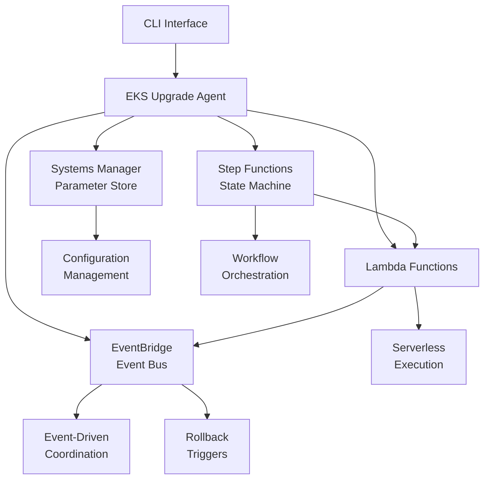

# AWS Orchestration Services Integration

The EKS Upgrade Agent leverages AWS orchestration services to provide a robust, scalable, and event-driven upgrade workflow. This document describes the integration with AWS Step Functions, EventBridge, Systems Manager Parameter Store, and Lambda function templates.

## Overview

The AWS orchestration services provide the following capabilities:

- **Step Functions**: Orchestrate the upgrade workflow with state management and error handling
- **EventBridge**: Enable event-driven coordination and monitoring
- **Systems Manager Parameter Store**: Secure configuration and credential management
- **Lambda Templates**: Serverless execution of upgrade phases

## Architecture



## Step Functions Integration

### State Machine Definition

The upgrade workflow is orchestrated using AWS Step Functions with the following states:

1. **PerceptionPhase**: Collect cluster state and environment data
2. **ReasoningPhase**: Analyze data and generate upgrade plan
3. **ExecutionPhase**: Execute upgrade steps
4. **ValidationPhase**: Validate upgrade success
5. **CheckValidationResult**: Decision point for success/failure
6. **UpgradeSuccess**: Successful completion
7. **TriggerRollback**: Initiate rollback on failure
8. **HandleFailure**: Handle execution failures
9. **UpgradeFailure**: Failed completion with rollback

### Usage Example

```python
from eks_upgrade_agent.common.aws.orchestration import (
    StepFunctionsClient,
    StateMachineDefinition,
    create_upgrade_state_machine_definition
)

# Initialize client
sf_client = StepFunctionsClient(region="us-east-1")

# Create state machine definition
definition_dict = create_upgrade_state_machine_definition(
    cluster_name="my-cluster",
    target_version="1.29",
    strategy="blue_green"
)

definition = StateMachineDefinition(
    name="eks-upgrade-workflow",
    definition=definition_dict,
    role_arn="arn:aws:iam::123456789012:role/step-functions-role"
)

# Deploy state machine
state_machine_arn = sf_client.create_state_machine(definition)

# Start execution
execution_arn = sf_client.start_execution(
    state_machine_arn,
    {
        "cluster_name": "my-cluster",
        "target_version": "1.29",
        "strategy": "blue_green"
    }
)

# Wait for completion
result = sf_client.wait_for_execution(execution_arn)
```

### Error Handling

The state machine includes comprehensive error handling:

- **Catch blocks**: Capture errors at each phase
- **Retry logic**: Automatic retry for transient failures
- **Rollback triggers**: Automatic rollback on critical failures
- **Error context**: Preserve error information for debugging

## EventBridge Integration

### Event Types

The system publishes the following event types:

- `upgrade.started`: Upgrade process initiated
- `upgrade.completed`: Upgrade completed successfully
- `upgrade.failed`: Upgrade failed
- `phase.started`: Individual phase started
- `phase.completed`: Individual phase completed
- `phase.failed`: Individual phase failed
- `validation.success`: Validation passed
- `validation.failure`: Validation failed
- `rollback.triggered`: Rollback initiated
- `rollback.completed`: Rollback completed
- `traffic.shifted`: Traffic percentage shifted
- `cluster.provisioned`: New cluster provisioned
- `cluster.decommissioned`: Old cluster decommissioned

### Usage Example

```python
from eks_upgrade_agent.common.aws.orchestration import (
    EventBridgeClient,
    UpgradeEvent,
    create_upgrade_monitoring_rule
)

# Initialize client
eb_client = EventBridgeClient(bus_name="default", region="us-east-1")

# Publish upgrade started event
event_id = eb_client.publish_upgrade_started(
    cluster_name="my-cluster",
    target_version="1.29",
    strategy="blue_green"
)

# Publish validation result
event_id = eb_client.publish_validation_result(
    cluster_name="my-cluster",
    success=True,
    metrics={"error_rate": 0.01, "latency_p99": 150}
)

# Create monitoring rule
monitoring_rule = create_upgrade_monitoring_rule("my-cluster")
rule_arn = eb_client.create_rule(monitoring_rule)
```

### Event-Driven Coordination

EventBridge enables loose coupling between components:

- **Monitoring**: CloudWatch integration for metrics and alarms
- **Notifications**: SNS integration for operator alerts
- **Rollback Triggers**: Automatic rollback on validation failures
- **Audit Logging**: Complete event history for compliance

## Systems Manager Parameter Store Integration

### Configuration Management

SSM Parameter Store provides secure configuration management:

- **Hierarchical organization**: Nested parameter structure
- **Encryption**: SecureString parameters for sensitive data
- **Versioning**: Parameter version history
- **Access control**: IAM-based permissions
- **Cost optimization**: Standard and Advanced tiers

### Usage Example

```python
from eks_upgrade_agent.common.aws.orchestration import (
    SSMClient,
    ParameterConfig,
    create_default_agent_config
)

# Initialize client
ssm_client = SSMClient(
    region="us-east-1",
    parameter_prefix="/eks-upgrade-agent/"
)

# Store configuration
config = create_default_agent_config()
results = ssm_client.put_configuration(config, "production")

# Store individual parameter
param_config = ParameterConfig(
    name="cluster/production/name",
    value="prod-eks-cluster",
    type="String",
    description="Production EKS cluster name",
    tags={"Environment": "production"}
)
version = ssm_client.put_parameter(param_config)

# Store secure parameter
secret_config = ParameterConfig(
    name="api/github/token",
    value="ghp_xxxxxxxxxxxx",
    type="SecureString",
    description="GitHub API token",
    key_id="alias/eks-upgrade-agent"
)
version = ssm_client.put_parameter(secret_config)

# Retrieve configuration
config = ssm_client.get_configuration("production")
```

### Security Best Practices

- **Encryption**: Use SecureString for sensitive parameters
- **KMS Integration**: Custom KMS keys for encryption
- **IAM Policies**: Least privilege access
- **Parameter Naming**: Consistent hierarchical naming
- **Tagging**: Comprehensive resource tagging

## Lambda Function Templates

### Available Templates

The system provides Lambda function templates for each upgrade phase:

1. **Perception Lambda**: Collect cluster state and environment data
2. **Reasoning Lambda**: Analyze data and generate upgrade plans
3. **Execution Lambda**: Execute upgrade operations
4. **Validation Lambda**: Validate upgrade success
5. **Rollback Lambda**: Handle rollback operations

### Usage Example

```python
from eks_upgrade_agent.common.aws.orchestration import (
    LambdaTemplateManager,
    create_perception_lambda,
    get_all_lambda_templates
)

# Initialize manager
lambda_manager = LambdaTemplateManager(region="us-east-1")

# Get perception Lambda template
perception_template = create_perception_lambda()

# Deploy function
deployment = lambda_manager.deploy_function(perception_template)

# Invoke function
result = lambda_manager.invoke_function(
    "eks-upgrade-agent-perception",
    {
        "cluster_name": "my-cluster",
        "target_version": "1.29"
    }
)

# Get all templates
templates = get_all_lambda_templates()
for template in templates:
    deployment = lambda_manager.deploy_function(template)
```

### Function Configuration

Each Lambda function template includes:

- **Runtime**: Python 3.12
- **Memory**: Optimized for each phase (512MB - 1024MB)
- **Timeout**: Phase-appropriate timeouts (300s - 900s)
- **Environment Variables**: Configuration and logging
- **IAM Role**: Least privilege permissions
- **Tags**: Component and phase identification

## Integration Patterns

### Workflow Orchestration

```python
# Complete workflow integration
async def run_upgrade_workflow(cluster_name: str, target_version: str):
    # 1. Store configuration
    config = {
        "cluster_name": cluster_name,
        "target_version": target_version,
        "strategy": "blue_green"
    }
    ssm_client.put_configuration(config, f"upgrade-{cluster_name}")

    # 2. Publish upgrade started event
    eb_client.publish_upgrade_started(cluster_name, target_version, "blue_green")

    # 3. Start Step Functions execution
    execution_arn = sf_client.start_execution(
        state_machine_arn,
        {
            "cluster_name": cluster_name,
            "target_version": target_version
        }
    )

    # 4. Monitor execution
    result = sf_client.wait_for_execution(execution_arn)

    # 5. Publish completion event
    if result.status == "SUCCEEDED":
        eb_client.publish_upgrade_completed(cluster_name, target_version, 1800)
    else:
        eb_client.publish_upgrade_failed(cluster_name, target_version, result.error, "execution")
```

### Event-Driven Rollback

```python
# Automatic rollback on validation failure
def setup_rollback_automation():
    # Create rollback trigger rule
    rollback_rule = create_rollback_trigger_rule()
    eb_client.create_rule(rollback_rule)

    # Rule automatically triggers rollback Lambda on validation failure
    # EventBridge pattern matches validation.failure events
    # Lambda function redirects traffic and cleans up resources
```

### Configuration Lifecycle

```python
# Configuration management lifecycle
def manage_upgrade_configuration(cluster_name: str):
    # Store pre-upgrade configuration
    pre_config = collect_cluster_configuration(cluster_name)
    ssm_client.put_configuration(pre_config, f"pre-upgrade-{cluster_name}")

    # Store upgrade parameters
    upgrade_config = create_upgrade_configuration(cluster_name)
    ssm_client.put_configuration(upgrade_config, f"upgrade-{cluster_name}")

    # Retrieve during upgrade
    config = ssm_client.get_configuration(f"upgrade-{cluster_name}")

    # Clean up after upgrade
    ssm_client.delete_parameters([f"upgrade-{cluster_name}"])
```

## Monitoring and Observability

### CloudWatch Integration

- **Metrics**: Step Functions execution metrics
- **Logs**: Lambda function logs and EventBridge events
- **Alarms**: Automated alerting on failures
- **Dashboards**: Real-time upgrade monitoring

### Event Tracking

- **Event History**: Complete audit trail in EventBridge
- **State Transitions**: Step Functions execution history
- **Parameter Changes**: SSM parameter version history
- **Function Invocations**: Lambda execution logs

### Cost Optimization

- **Parameter Tiers**: Use Standard tier for most parameters
- **Function Memory**: Right-size Lambda memory allocation
- **Event Filtering**: Targeted EventBridge rules
- **State Machine Optimization**: Minimize execution time

## Security Considerations

### IAM Permissions

```json
{
  "Version": "2012-10-17",
  "Statement": [
    {
      "Effect": "Allow",
      "Action": [
        "states:StartExecution",
        "states:DescribeExecution",
        "states:StopExecution"
      ],
      "Resource": "arn:aws:states:*:*:stateMachine:eks-upgrade-*"
    },
    {
      "Effect": "Allow",
      "Action": ["events:PutEvents"],
      "Resource": "arn:aws:events:*:*:event-bus/default"
    },
    {
      "Effect": "Allow",
      "Action": [
        "ssm:GetParameter",
        "ssm:GetParameters",
        "ssm:GetParametersByPath",
        "ssm:PutParameter"
      ],
      "Resource": "arn:aws:ssm:*:*:parameter/eks-upgrade-agent/*"
    },
    {
      "Effect": "Allow",
      "Action": ["lambda:InvokeFunction"],
      "Resource": "arn:aws:lambda:*:*:function:eks-upgrade-agent-*"
    }
  ]
}
```

### Encryption

- **SSM Parameters**: Use SecureString with KMS encryption
- **EventBridge**: Server-side encryption for event data
- **Lambda**: Environment variable encryption
- **Step Functions**: State data encryption

### Network Security

- **VPC Integration**: Deploy Lambda functions in VPC
- **Security Groups**: Restrict network access
- **Private Endpoints**: Use VPC endpoints for AWS services
- **TLS**: Encrypt all API communications

## Troubleshooting

### Common Issues

1. **IAM Permissions**: Ensure proper permissions for all services
2. **Parameter Limits**: Monitor SSM parameter limits and quotas
3. **Lambda Timeouts**: Adjust timeout values for long-running operations
4. **Event Delivery**: Monitor EventBridge event delivery failures
5. **State Machine Errors**: Check Step Functions execution history

### Debugging Tools

- **CloudWatch Logs**: Detailed execution logs
- **X-Ray Tracing**: Distributed tracing for Lambda functions
- **Step Functions Console**: Visual workflow debugging
- **EventBridge Monitoring**: Event delivery metrics
- **SSM Parameter History**: Parameter change tracking

### Performance Optimization

- **Lambda Provisioned Concurrency**: Reduce cold start latency
- **Step Functions Express Workflows**: For high-volume executions
- **EventBridge Archive**: Long-term event storage
- **SSM Parameter Caching**: Cache frequently accessed parameters

## Best Practices

### Design Principles

1. **Idempotency**: All operations should be idempotent
2. **Error Handling**: Comprehensive error handling and recovery
3. **Monitoring**: Extensive monitoring and alerting
4. **Security**: Least privilege access and encryption
5. **Cost Optimization**: Right-size resources and optimize usage

### Operational Guidelines

1. **Testing**: Thoroughly test all workflows in non-production
2. **Rollback**: Always have a rollback plan
3. **Documentation**: Maintain up-to-date documentation
4. **Monitoring**: Set up comprehensive monitoring and alerting
5. **Compliance**: Follow organizational security and compliance requirements

### Development Workflow

1. **Local Testing**: Test components locally with mocks
2. **Integration Testing**: Test with real AWS services in dev environment
3. **Staging Deployment**: Deploy to staging for end-to-end testing
4. **Production Deployment**: Gradual rollout to production
5. **Monitoring**: Continuous monitoring and optimization
